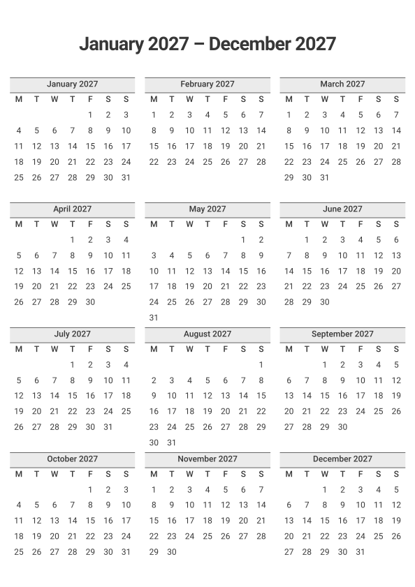
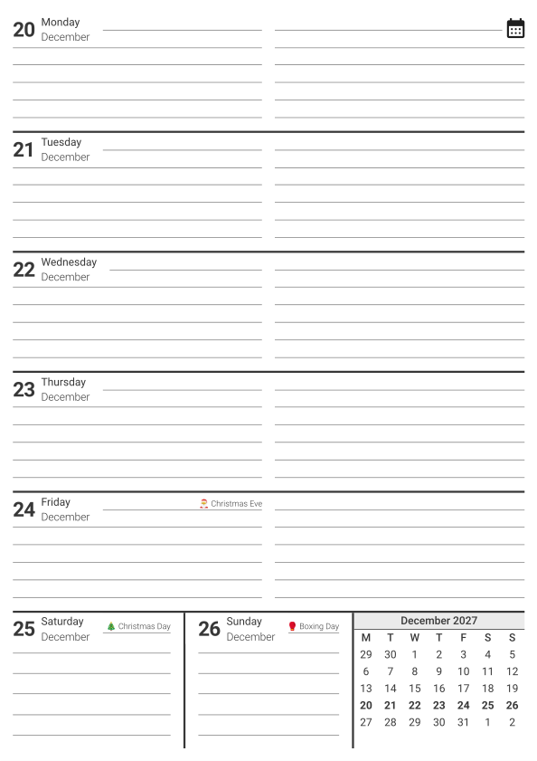

# Diary

An A4 week-to-view diary PDF.




## Download

Ready-made PDFs are attached to the [releases page](https://github.com/Tom-Johnston/diary/releases).

## Building your own

You need [Go](https://go.dev/dl/), the Roboto font (or accept the default sans-serif font) and a browser.

1. Set the date range and title at the top of [`main.go`](main.go). The title is copied into the PDF's Title field but does not appear in the contents of the PDF.

   ```go
	title := "Diary 2027"
	// Inclusive.
	startDate := time.Date(2027, time.January, 1, 0, 0, 0, 0, time.UTC)
	// Not inclusive.
	endDate := startDate.AddDate(1, 0, 0)
   ```

2. (Optional) Add any dates you wish to appear in the PDF to [`important-dates.csv`](important-dates.csv).
Each row should contain the date, the name of the occasion and optionally a size for the text (e.g. `0.6rem`).
A date can have more than one row, and each row is shown on its own line.

   ```csv
   Date,Occasion,Font-size
   25/12/2026,🎄 Christmas Day ★,
   08/11/2026,Remembrance Sunday,0.6rem
   ```

3. Generate `diary.html`.

   ```sh
   go run main.go
   ```

4. Open `diary.html` in your browser and print it with **Save to PDF** as the destination. The stylesheet already sets A4 paper with no margins and the default print settings should work.